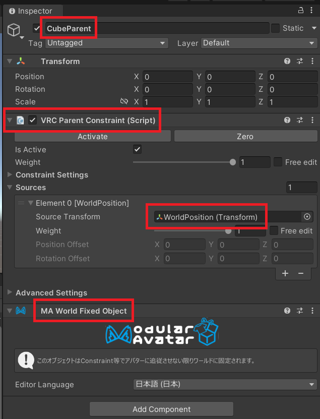
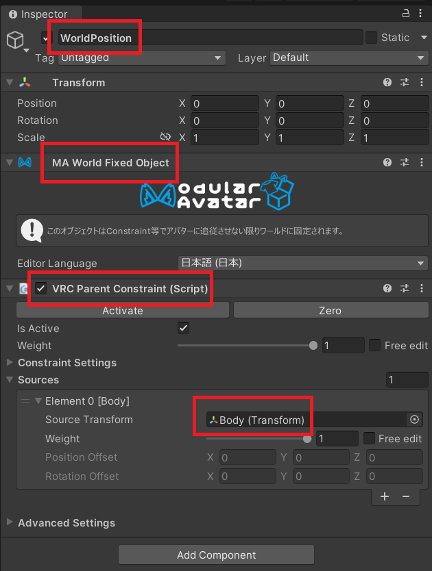
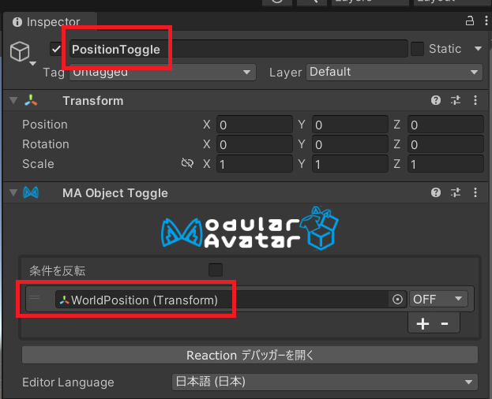

# メタデータ
- title=Modular Avatarを使ってVRChatのアバターのオブジェクトをワールドに固定する
- description=Modular Avatarを使ってVRChatで動かすアバターのオブジェクトをワールドに固定します。オブジェクトにアニメーションは付けたままです。
- date=2025年10月03日（金）
- update=2025年10月03日（金）
- math=false
- tag=vrchat

## はじめに

Modular Avatarを使ってVRChatのアバターに取り付けたオブジェクトをワールドに固定します。

固定

また、この記事を書くにあたって下記の記事を参考にさせていただきました。

https://note.com/kerotama9/n/n486676b75c2c

【VRChat/Unity】ワールド固定ギミックを作る

## 開発環境

- Windows 11
- Unity 2022.3.22f1

## 前回の記事

今回は前回作成したCubeとCubeを回転させるアニメーションをそのまま使用します。

https://yusukekato.jp/html/2025/0930.html

VRChatのアバターのオブジェクトにアニメーションを設定する

また、アバターはニコニコのアリシア・ソリッドの3Dモデルを使用しています。

https://yusukekato.jp/html/2025/0927.html

公開されているVRMモデルをVRChatで動かす

## オブジェクトの構成

アバターに下記のようにオブジェクトを追加しています。

- CubeToggle：Modular AvatarのToggleを使ってCubeの表示と非表示を切り替えます（前回の記事で作成したものなので説明は省略）
- CubeParent：Cubeの位置を固定するための親オブジェクトです。Unityでは子オブジェクトは親オブジェクトの座標系に依存するため、親オブジェクトを作ってCubeの座標を決定させます。つまり、厳密にはCubeをワールドに固定するのではなく、CubeParentをワールドに固定します。
- Cube：ワールドに固定するオブジェクトです。Cubeには前回の記事で回転アニメーションを設定してあります。（前回の記事で作成したものなので説明は省略）
- PositionToggle：Modular AvatarのToggleを使ってWorldPositionオブジェクトの表示と非表示を切り替えます。
- WorldPosition：CubeParentオブジェクトの位置を決定するためのオブジェクトです。WorldPositionを非表示から表示へ切り替えるとCubeParentがWorldPositionの位置に固定されるように設定します。

オブジェクト

## CubeParentオブジェクト

CubeParentはCubeの座標系の役割となって、Cubeの位置を決めるために使用します。
CubeParentはVRC Parent Constraintを使ってWorldPositionオブジェクトの位置に固定します。
また、MA World Fixed Objectを取り付けてワールドに固定します。
以上の設定により、CubeParentは表示された瞬間にWorldPositionの位置でワールドに固定されます。

CubeParent

## WorldPositionオブジェクト

WorldPositionはワールド内の座標情報の役割を担います。
WorldPositionはVRC Parent Constraintを使ってアバター（ここではBodyオブジェクト）を追従します。
また、MA World Fixed Objectを取り付けてワールドに固定します。
つまり、WorldPositionを表示させた瞬間に、WorldPositionは現在のアバターの位置に固定されます。
これによって、CubeParentはWorldPositionに固定されるので、結果としてCubeParentの位置に依存しているCubeは現在のアバターの位置に固定されることになります。

WorldPosition

## PositionToggleオブジェクト

Modular Avatarを使ってWorldPositionの表示と非表示を切り替えます。

PositionToggle

設定は以上です。

## VRChatでワールド固定できるか確認

それではいつもの手順でアバターをVRChatへアップロードします。

メニューでToggleを操作するとワールド固定と解除を行えることが確認できました。

固定

## おわりに

VRChatでアバターのオブジェクトをワールドに固定する方法を試してみました。
Modular Avatarを使うとギミックを簡単に設定できてありがたいです。
思った以上にアバターも自由に遊べそうなので嬉しいですね。
他にもいろいろできそうなのでいろいろ遊んでみようと思います。
それでは、また。