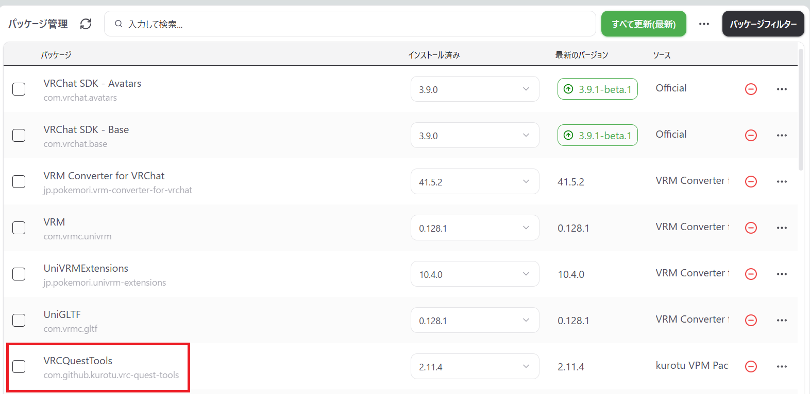
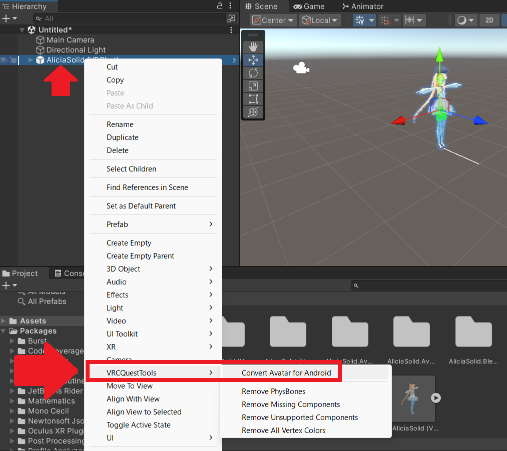
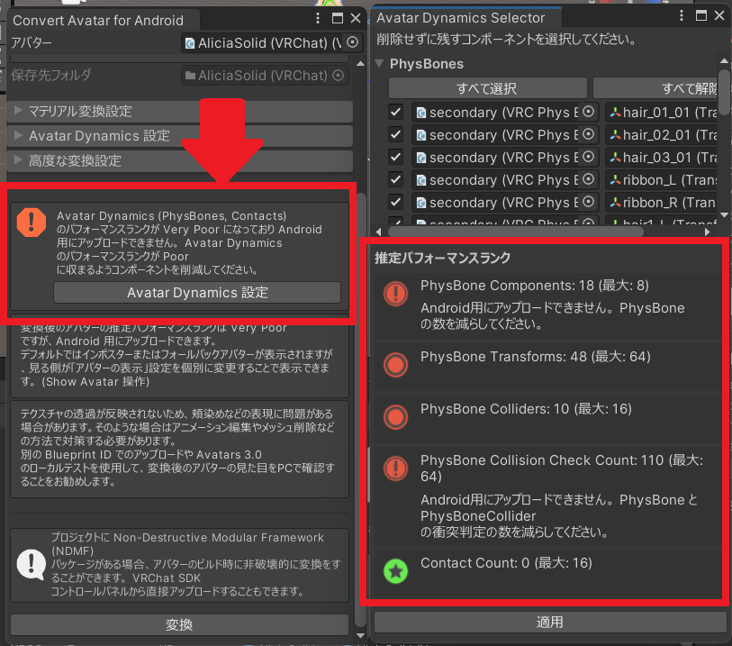
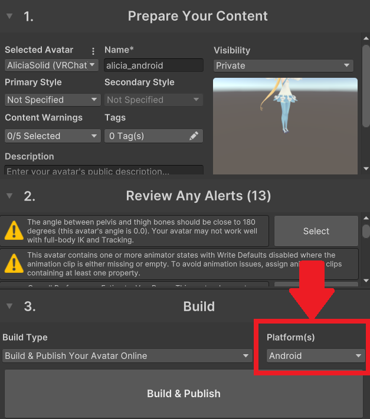

# メタデータ
- title=VRChatのスマホアプリ（Android）用にアバターをアップロードする
- description=VRChatのスマホアプリ向けにアバターをアップロードします。Android版で試しました。
- date=2025年11月01日（土）
- update=2025年11月01日（土）
- math=false
- tag=vrchat

## はじめに

VRChatのスマホアプリ向けにアバターをアップロードします。
スマホアプリ版ではアバターのデータサイズの制約が厳しかったり、
アバターで使用できるシェーダなどに制限があったりするようです。

スマホアプリの様子

また、この記事を書くにあたって下記の記事を参考にさせていただきました。
詳細な情報はこちらの記事で紹介されていますので、私の記事では手順だけ紹介できればと思います。

https://lukesplaygrounds.com/how-to-make-avatar-world-compatible-with-android-ios-and-quest/

【VRChat】アバター・ワールドをAndroid・iOS・Questに対応させる方法

## 開発環境

- Windows 11
- Unity 2022.3.22f1

## 前回の記事

前回はModular Avatarでアバターのオブジェクトをワールドに固定する方法を紹介しました。

https://yusukekato.jp/html/2025/1003.html

Modular Avatarを使ってVRChatのアバターのオブジェクトをワールドに固定する

また、アバターはニコニコのアリシア・ソリッドの3Dモデルを使用しています。

https://yusukekato.jp/html/2025/0927.html

公開されているVRMモデルをVRChatで動かす

## UnityにAndroidのビルドに必要なモジュールをインストール

Unityのデフォルトの状態ではAndroid向けのビルドができないため、
Unity HubのInstallsタブでAndroid用のモジュールを追加します。
iOSでも同じ手順になるかと思います。

まず、使用するUnityのバージョンでManageから「Add modules」を選択します。

Add modules

Platformsの中の「Android Build Support」（必要であればiOSも）にチェックを入れて、Continueボタンをクリックします。
その後は手順に従って進めたらインストール完了です。

モジュール追加

## VCC（ALCOM）にVRCQuestToolsを追加

VRCQuestToolsを使ってPC向けのアバターをAndroid向けに変換します。
もしかしたらアバターによっては変換なしでアップロードできるかもしれませんが、
私の場合は変換をしないとアップロード時にエラーが出ました。

https://booth.pm/ja/items/2436054?srsltid=AfmBOoo6Yrk8ZvLlSd7bcIx24e2V5hbZ0Gq0YbuZGBDf2U1qA1jakGV-

Booth - VRCQuestTools

導入手順はVRCQuestToolsのBoothページに記載のとおりです。

下記のリンク先にアクセスすると自動的にVCC（ALCOM）にVRCQuestToolsが追加されます。

https://kurotu.github.io/vpm-repos/vpm.html

インストールのURL

無事に追加できたらVCC（ALCOM）でUnityのパッケージを作成してVRCQuestToolsをインストールします。

ALCOMの画面

## アバターをAndroid用に変換

通常のアバターアップロード手順のようにUnityプロジェクトにアバターを追加します。
この時、アバターはPC向けにアップロードできる状態にしておきます。

アバターを右クリックして「VRCQuestTools」の「Covert Avatar Android」を選択します。

選択

基本的には変換のウィンドウが開いたら「変換」ボタンを押せば完了ですが、
スマホアプリではアバターのデータサイズに制限があるため、
アバターのパフォーマンスランクが「がery Poor」の場合は修正が必要です。

下記の画面のように忠告が出た場合は、推定パフォーマンスランクが制限内になるように、PhysBonesやCollision関連のコンポーネントを削除します。

削減

## Android向けに切り替えてVRChatへアップロード

アバターを無事に変換できたらいつもの手順でアップロードします。
ただし、アップロード時はPlatformsでAndroidを選択します。

アップロード

## スマホアプリで確認

スマホでVRChatアプリを開きます。

アップロードしたアバターに切り替えられたら成功です。

アバター

## おわりに

今回はスマホアプリのAndroid向けにアバターをアップロードしました。
スマホでVRChatが遊べると何かと楽なので嬉しいですね。
これからもVRChatを楽しんでいきたいと思います。
それでは、また。