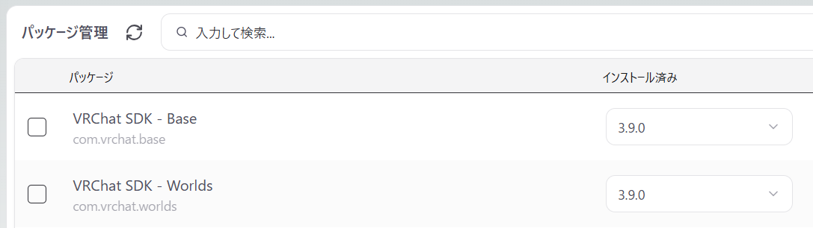
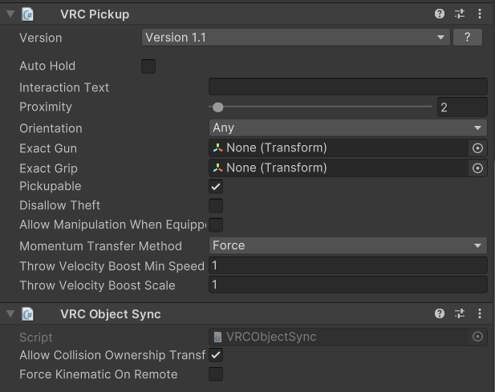
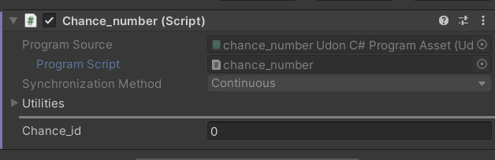

# メタデータ
- title=VRChatのワールドでオブジェクトと変数の同期を行う
- description=VRChatのワールド作成においてオブジェクトや変数の同期を試しました。ユーザがオブジェクトを操作する場合や、動的なゲームワールドなどを作る場合は各ユーザ間での同期処理が必須になると思いますので、参考になれば幸いです。
- date=2025年11月09日（日）
- update=2025年11月09日（日）
- math=false
- tag=vrchat

## はじめに

この記事では、VRChatのワールド作成における各ユーザ間の同期処理について紹介します。

オブジェクトを配置するだけの静的なワールドの場合は同期処理は必要ありませんが、
複数人のユーザが参加するゲームや、
動的なギミックがあるワールドの場合は、同期処理が必要になるかと思います。

同期処理について何かしら参考になれば幸いです。


ワールド作成中の様子

## 開発環境

開発環境は下記の通りです。

UnityやVRChat SDKのバージョンが異なると同じように動かない場合があります。

- Windows 11
- Unity 2022.3.22f1
- VRChat SDK 3.9.0

## 前回の記事

前回はVRChatのAndroidアプリ用にアバターをアップロードする方法を紹介しました。

https://yusukekato.jp/html/2025/1101.html

VRChatのスマホアプリ（Android）用にアバターをアップロードする

## ワールドについて

VRChatのワールドでは複数人のユーザが同じインスタンスに入っていても、
厳密にはそれぞれのユーザのローカル環境に別々のワールドが構築されるようです。
つまり、同期処理を実装していない場合は、
それぞれのユーザがローカル環境のワールドで何か変更を加えても、
その変更は他のユーザに共有されないことになります。

したがって、各ユーザでワールド内のオブジェクトの動きを共有したい場合などは、
同期処理の機能が必要になります。

また、ワールドの仕様として、
ワールドのインスタンスに一番最初に入ったユーザが「Master」となり、
オブジェクトのオーナー権限（所有権）を初めに取得します。
オブジェクトのオーナー権限をMasterユーザ以外に移したい場合は、
UdonスクリプトやVRChatのコンポーネントなどで移すことができます。

同期処理においては、オブジェクトのオーナー権限を持っているユーザがそのオブジェクトに変更を加えた時に、その変更が他のユーザに共有されます。
つまり、同期処理を考える際は、同期したいオブジェクトのオーナー権限を誰が持っているかを意識する必要があります。

このあたりの話は下記の公式サイトに記載があります。

https://creators.vrchat.com/worlds/udon/networking/

VRChat Creation - Networking

## Udonについて

UdonはVRChat用のプログラミング言語です。
基本的にはもともとUnityで使用できるC#がベースで、その上でVRChat用のライブラリも使えるみたいな感じかと思います。
Unityエディタ上で扱えるGUIも用意されているので、プログラムを書かなくても様々な処理を実装できます。

Udonを使えばインタラクティブなワールド（ユーザがオブジェクトを操作したり、ワールド内でゲームが遊べたりなど）を作成できます。

Udonの公式情報は下記です。

https://creators.vrchat.com/worlds/udon/

VRChat Creation - Udon

## ワールド用プロジェクトを作成

VCCやALCOMでVRChatのワールド用のUnityプロジェクトを作成します。
この時、VRChat SDKが追加されていることを確認しておきます。



ワールド作成

## オブジェクトの位置と姿勢を同期させる

オブジェクトの位置（position）と姿勢（rotation）を同期させる方法を紹介します。

まず適当な3Dオブジェクト（ここではsphere）を作成します。
そして、そのオブジェクトのInspector画面で「Add Component」ボタンを押して、「VRC Pickup」と「VRC Object Sync」を追加します。

VRC Pickupを追加するとそのオブジェクトをユーザが持てるようになります。
また、このVRC Pickupを付けると、そのオブジェクトを持ったユーザが自動的にそのオブジェクトのオーナー権限を取得できます。

VRC Object Syncはオブジェクトに追加するだけで、そのオブジェクトの位置や姿勢が同期されます。
ただし、オブジェクトのオーナー権限を持っているユーザがそのオブジェクトを動かした時のみに同期されるので注意が必要です。
今回はVRC Pickupをオブジェクトに付けているため、そのオブジェクトを持ったユーザがオーナー権限を取得して同期が成功します。

VRC Pickupを使わない場合は、Udonのスクリプトを書くなどして、オブジェクトのオーナー権限を移動させる処理の実装が必要になるかと思います。



コンポーネントをアタッチ

ちなみに補足として、3DオブジェクトにはデフォルトでRigidbodyコンポーネントが追加されており、「Use Gravity」がONになっています。
このままだとオブジェクトに重力が働き、地面に落ちます。
オブジェクトを空中に浮かせたい場合はこのUse Gravityをオフにしておきます。


Use Gravity設定

設定が完了したらUnityエディタの再生ボタンを押してVRChatワールドのシミュレーションを行います。
オブジェクトをクリックすると持つことができるかと思います。
同期処理がうまくいっているかは実際にVRChatにワールドをアップロードして動作確認するとよいかと思います。

Unity上でも複数ユーザのシミュレーションができそうですが、まだよく分かっていません。
また、実際にVRChat上で動作確認したほうが確実かと思います。


Unity上で動作確認

以上でオブジェクトの位置と姿勢の同期は完了です。

## Udonのスクリプトの変数を同期させる

Udonには変数を同期させる機能が備わっています。

まず、Udonのスクリプトを作成します。
先ほどの3DオブジェクトのInspector画面で「Add Component」ボタンを押して、
「Udon Behaviour」を追加します。
それからUdon Behaviourで「Udon C# Program Asset」を選択してから「New Program」ボタンを押します。
スクリプト名を入力するとUdonのスクリプトが作成できます。


Udon Behaviour

ここでは「chance_number」というスクリプトを作成しています。



スクリプト

作成したスクリプトをエディタで開くと下記のようなプログラムになっているかと思います。

```
using UdonSharp;
using UnityEngine;
using VRC.SDKBase;
using VRC.Udon;

public class chance_number : UdonSharpBehaviour
{
    void Start()
    {
    }
}
```

プログラムを下記のように書き換えます。

処理の内容は、ワールド作成時に0～15の範囲でランダムにIDを取得しています。

変数の前に`[UdonSynced]`を付けると、その変数を同期させることができます。

同期処理はMasterユーザ（このオブジェクトのオーナー権限を持っているユーザ）が変更を加えた時のみ、他のユーザに同期されます。
そのため、` if (Networking.IsMaster) {`の条件分岐処理で、
MasterユーザだけがIDの取得処理を実行します。

```
using UdonSharp;
using UnityEngine;
using VRC.SDKBase;
using VRC.Udon;

[UdonBehaviourSyncMode(BehaviourSyncMode.Continuous)]
public class chance_number : UdonSharpBehaviour
{
    private const int MAX_OBJECTS = 16;
    [UdonSynced] public int chance_id = 0;

    void Start()
    {
        if (Networking.IsMaster) {
            chance_id = Random.Range(0, MAX_OBJECTS);
        }
    }
}
```

以上のプログラムを書くことで変数をユーザ間で同期させることができます。

ただし、注意点として、変数の同期は（おそらく）オブジェクトごとにしか行われません。
つまり、各ユーザごとの同じオブジェクトに付いている同じスクリプト内の変数が同期されます。

たとえば、今回の`chance_id`を他のスクリプトでも参照したい場合は、
下記のように対象のスクリプトから対象の変数にアクセスします。
これはUdonの機能というよりもUnityのC#の書き方になります。

`[SerializeField] UdonSharpBehaviour chance_number_script;`の行を書くことで、
Unityエディタ上のInspector画面で対象のスクリプト（chance_number）を設定できます。

その後、`int chance_id = (int)chance_number_script.GetProgramVariable("chance_id");`の行でchance_numberスクリプトからchance_id変数の値を取得します。

補足として、`VRCPlayerApi player = Networking.GetOwner(this.gameObject);`の行でオブジェクトを持っているユーザの情報を取得しています。
ユーザに対して何か変更を加えたい場合はこのようにユーザ情報を取得する必要があります。
ここではユーザに強制的にジャンプさせています（かなり強くジャンプさせる）。

```
using UdonSharp;
using UnityEngine;
using VRC.SDKBase;
using VRC.Udon;

public class sphere_button : UdonSharpBehaviour
{
    private const float jump_force = 50f;
    [SerializeField] private int button_id = 0;
    [SerializeField] UdonSharpBehaviour chance_number_script;

    public override void OnDrop()
    {
        int chance_id = (int)chance_number_script.GetProgramVariable("chance_id");
        if (button_id == chance_id)
        {
            VRCPlayerApi player = Networking.GetOwner(this.gameObject);
            Vector3 upward_velocity = new Vector3(0f, jump_force, 0f);
            player.SetVelocity(upward_velocity);
        }
    }
}
```

以上で変数の同期は完了です。

## おわりに

今回はVRChatのワールド作成におけるオブジェクトの位置と姿勢の同期方法と、
Udonスクリプトの変数の同期方法を紹介しました。
ワールド作成を行う上で同期処理はかなり重要な機能ではありますが、
意外とややこしかったので、まとめてみました。
何かしら参考になれば嬉しい限りです。
それでは、また。

## 次回の記事

次回はアバターに座ったり寝っ転がったりするモーションを設定するためにGoGo Locoを導入する方法を紹介します。

https://yusukekato.jp/html/2025/1116.html

VRChatのアバターにGoGo Locoを導入して座ったり寝っ転がったりする