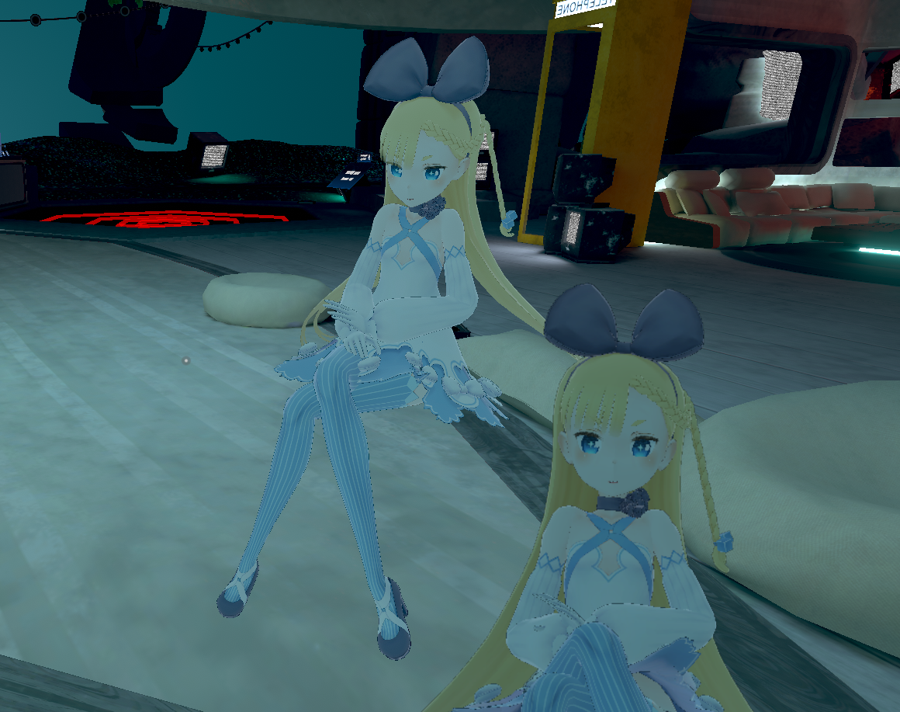
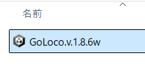
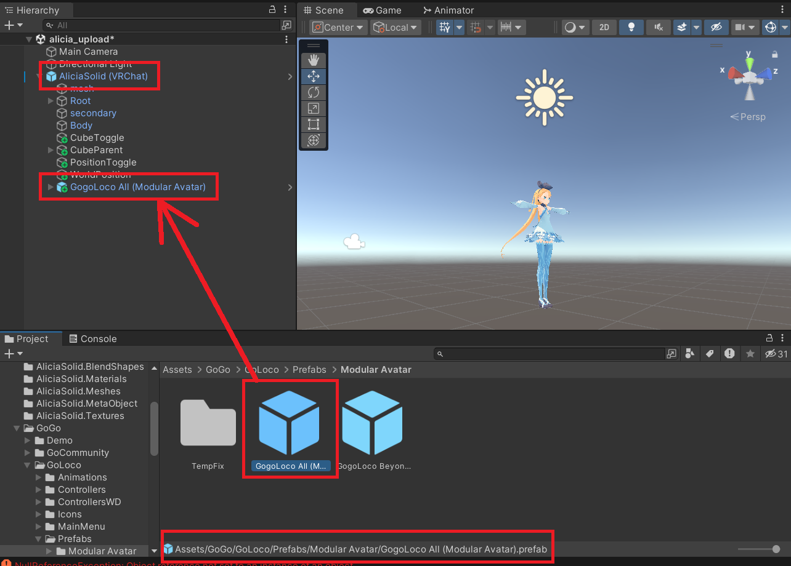
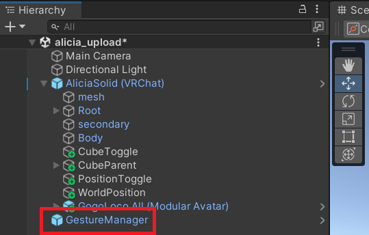
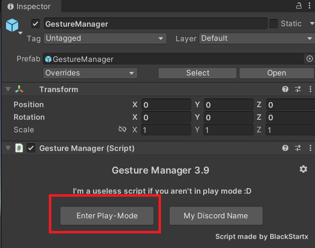
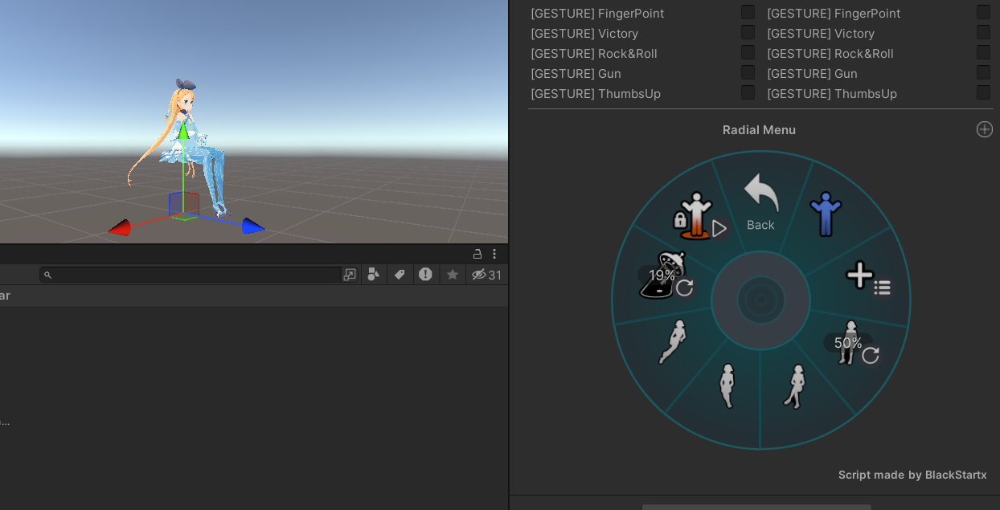

# メタデータ
- title=VRChatのアバターにGoGo Locoを導入して座ったり寝っ転がったりする
- description=VRChatのアバターに座ったり寝っ転がったりするモーションを簡単に設定できるGoGo Locoの導入方法を紹介します。
- date=2025年11月16日（日）
- update=2025年11月16日（日）
- math=false
- tag=vrchat

## はじめに

VRChatのアバターに座ったり寝っ転がったりするモーションを簡単に設定できるfranadaさんのGoGo Locoの導入方法を紹介します。
デフォルトだと立ち姿としゃがむ姿くらいしか用意されていないので、GoGo Locoを導入しておくとコミュニケーションの幅が広がるかと思います。

GoGo LocoはBoothからダウンロードできます。

https://booth.pm/ja/items/3290806?srsltid=AfmBOoo2AcPHRY47edkrRIg9XipxCnXFH8H9qhgydgs6YYHuVDQcer-3

Booth - GoGo Loco

実際にVRChatで座っている様子↓

VRChatの様子

## 開発環境

開発環境は下記の通りです。

UnityやVRChat SDKのバージョンが異なると同じように動かない場合があります。

- Windows 11
- Unity 2022.3.22f1
- VRChat SDK 3.9.0

また、アバターはニコニコのアリシア・ソリッドの3Dモデルを使用しています。

https://yusukekato.jp/html/2025/0927.html

公開されているVRMモデルをVRChatで動かす

## 前回の記事

前回はワールド作成における同期処理について紹介しました。

https://yusukekato.jp/html/2025/1109.html

VRChatのワールドでオブジェクトと変数の同期を行う

## GoGo Locoをダウンロード

まずBoothからGoGo Locoをダウンロードします。

https://booth.pm/ja/items/3290806?srsltid=AfmBOoo2AcPHRY47edkrRIg9XipxCnXFH8H9qhgydgs6YYHuVDQcer-3

Booth - GoGo Loco（再掲）

基本無料でダウンロードできますが、サポートとして450円を払うこともできます（お礼としても）。

Boothの様子

## Unityプロジェクトの作成

VCCやALCOMでアバターアップロード用にUnityプロジェクトを作成します。
必要なパッケージとして「Gesture Manager」と「Modular Avatar」を追加します。

Gesture Managerはデフォルトで選択できるかと思います。
Modular Avatarは公式サイトの説明に沿って導入すると良いかと思います。

https://modular-avatar.nadena.dev/ja/docs/intro

Modular Avatarの公式サイト

パッケージ管理

## UnityプロジェクトにGoGo Locoをインポート

Unityプロジェクトを開いたら、AssetsタブからImport Package -> Custom Packageを選択して、ダウンロードしたGoGo Locoをインポートします。

インポート

2025年11月16日現在では「GoLoco.v.1.8.6w」という名前のUnityパッケージになっています。

インポート

## アバターにGoGo Locoを追加

Assetsフォルダ内にインポートしたGoGo Locoをアバターに追加します。
今回はModular Avatarを使用するので、GoGo -> GoLoco -> Prefabs -> Modular Avatar -> GogoLoco All.prefabを追加します。

GoGo Locoを追加

## アバターにGesture Managerを追加

Unityエディタ上でGoGo Locoの動作確認がしたいので、Gesture Manager Emulatorを追加します。
Toolsタブの「Gesture Manager Emulator」をクリックします。

Gesture Managerを追加

追加した様子↓

追加した様子

## Unityエディタ上で動作確認

Gesture ManagerのInspector画面を表示すると「Enter Play-Mode」ボタンがあるので押します。

動作確認

Unityエディタがプレイ状態になるとVRChatの操作パネルが表示されるので、Expressionsを選択して「GoGo Loco」があることを確認します。

GoGo Loco確認

あとはパネルをポチポチ操作してモーションを確認します。

たとえばアバターが座るモーションの動作確認ができます。

座る

## VRChatへアップロード

これで設定は完了したので、最後にVRChatへアップロードします。

VRChatでもGoGo Locoのモーションが動くことを確認しました。

VRChatで動作確認

## おわりに

今回はGoGo Locoをアバターに導入して座ったり寝っ転がったりできるように設定する方法を紹介しました。
アバターでいろいろなモーションができるとコミュニケーションの幅が広がって便利になるかと思います。
GoGo Locoを使用すると簡単に素敵なモーションを導入できるのでとてもありがたいです。
私もどんどん使っていこうと思います。
それでは、また。