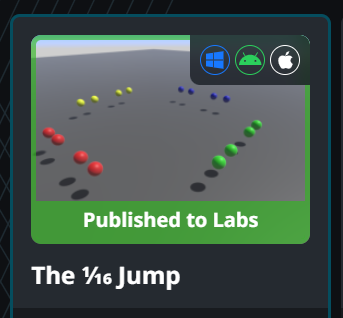

# メタデータ
- title=VRChatでワールドをパブリック（コミュニティーラボ）へアップロードする
- description=ようやくVRChatのユーザーランクがUserへ上がったのでワールドをPublic（パブリック）としてアップロードしてみます。厳密にはCommunity Labs（コミュニティーラボ）へアップロードします。
- date=2025年11月17日（月）
- update=2025年11月17日（月）
- math=false
- tag=vrchat

## はじめに

ようやくVRChatのユーザーランクが「User」へ上がったので、
ワールドをPublic（パブリック）としてアップロードしてみます。
厳密にはワールドはCommunity Labs（コミュニティーラボ）へまずはアップロードするようです。

実際にVRChatで座っている様子↓

VRChatの様子

## 開発環境

開発環境は下記の通りです。

UnityやVRChat SDKのバージョンが異なると同じように動かないがあります。

- Windows 11
- Unity 2022.3.22f1
- VRChat SDK 3.9.0

## 前回の記事

前回はGoGo Loco（座ったり寝っ転がったりするモーション）をアバターに導入する方法を紹介しました。

https://yusukekato.jp/html/2025/1116.html

VRChatのアバターにGoGo Locoを導入して座ったり寝っ転がったりする

## ユーザランクがUserへ上がった

気がついたらユーザランク（トラストランク）が「User」になっていました。
これでワールドをPublic（パブリック）として公開できるようになったはずです。

ちなみにランクが上がる条件は公開されていないようですが、プレイ時間やフレンド数、コンテンツ作成数、ワールド探索数などが重要なようです。
私の場合は下記のような状態です。

- プレイ時間：約32時間
- フレンド数：7人
- 訪れたワールド：約50～100個
- アバターやワールドのアップロード数：合計約10個

こんな感じなので、そこまでUserへ上がるのは難しくないのかもしれません。

Userランクへ上がった

詳しくはVRChatのWikiに記載があります。

https://wiki.vrchat.com/wiki/Trust_Rank/ja

VRChat Wiki - Trust Rank

## ワールドをパブリックでアップロードする

トラストランクがUserになるとワールドアップロード時にVisibilityで「Public」（最初はpublish to Community Labsだったと思う）が選択できるようになりました。
これでワールドをパブリックとして公開できるようです。

パブリックでアップロード

実際にアップロードしてみるとPrivate（プライベート）ではなく、
「Published to Labs」の状態でワールドをアップロードできました。

ワールドをアップロードした

## Community Labs（コミュニティラボ）について

作成したワールドはいきなりPublic（パブリック）としてはアップロードできず、最初はCommunity Labs（コミュニティラボ）にアップロードする必要があるようです。

コミュニティラボで他のユーザに遊んでもらって良い評価がもらえたらパブリックへ切り替えてもらえるようです。
VRChatの安全性を保つためのシステムのようです。

詳しくは公式サイトに記載があります。

https://docs.vrchat.com/docs/vrchat-community-labs

VRChat - Community Labs

## おわりに

今回はVRChatのワールドをパブリック（厳密にコミュニティラボ）へアップロードしてみました。
自分のワールドをいろいろな人に遊んでもらいたいので、
いずれはパブリックへアップロードできたら嬉しいですね。
これからも頑張ります。
それでは、また。