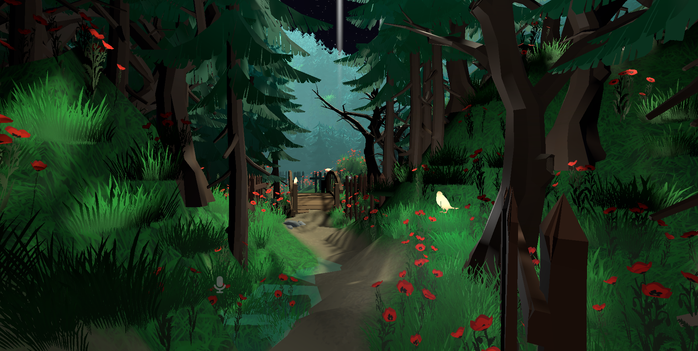
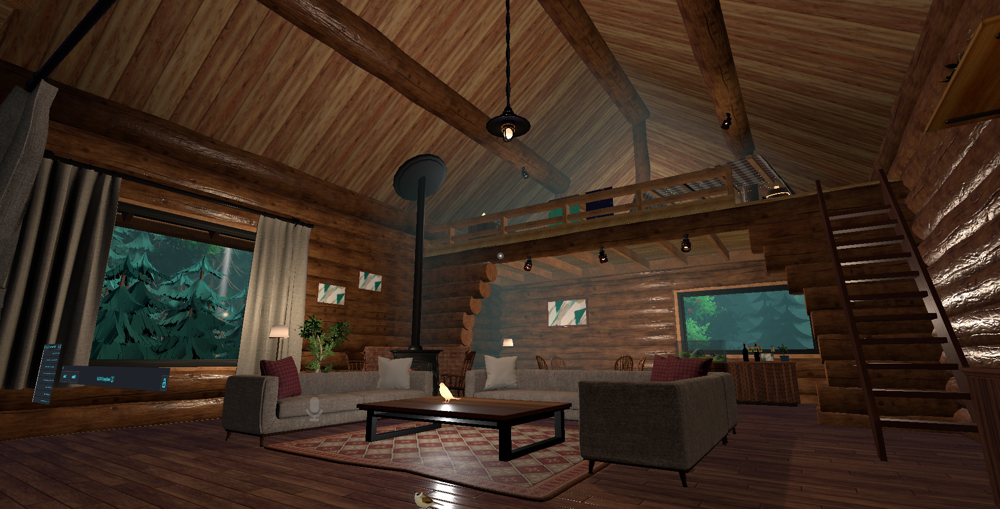
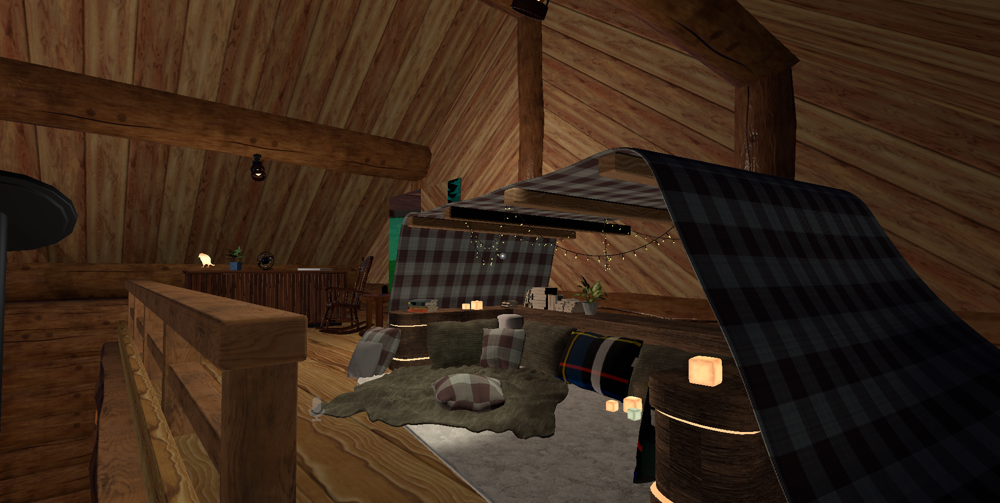
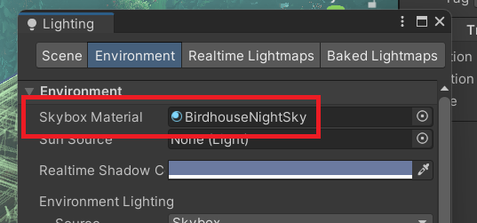
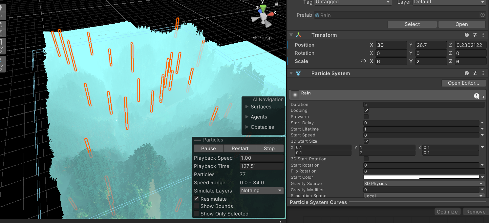
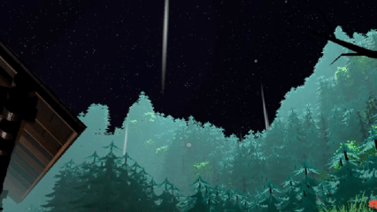
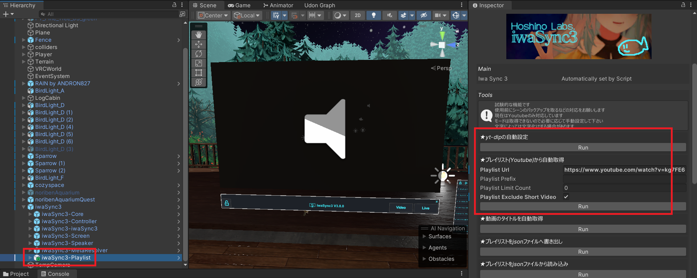
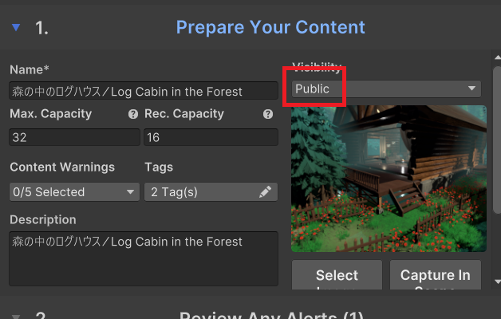

# メタデータ
- title=VRChatのワールド「森の中のログハウス」をUnityで作成してアップロードするまで
- description=VRChatのワールド「森の中のログハウス / Log Cabin in the Forest」を作成してアップロードするまでの流れを記録として残しておきます。これからワールド作成を行う方の参考になれば幸いです。
- date=2025年12月30日（火）
- update=2025年12月30日（火）
- math=false
- tag=vrchat

## はじめに

VRChatのワールドを本格的に作ってみたので作成の流れを記録として残しておきます。
これからワールドを作成する方の参考になれば幸いです。
ちなみに「本格的」とは言っても私の中での本格的なので凝ったワールドを作ったわけではありません。

## 作成したワールド

作成したワールドは「森の中のログハウス / Log Cabin in the Forest」です。
現在はCommunity Labsで公開している状態なのでVRChat上で検索すれば出てくるはずです。
よろしければぜひ。

ワールド

リスポーン地点はこんな感じです。
森の中からスタートで橋があります。

※木や草などの3DモデルデータはUnityのAsset Storeから入手しています（後述）

リスポーン地点

森の中の小道を進んでいきます。

小道

小道を進むとログハウスがあります。

※ログハウスの3DモデルデータはBoothにて購入したものを使用しています（後述）

ログハウス

ログハウスの中は広めです。

ログハウスの中

ロフトもあって住み心地が良いです。

ロフト

以上がざっくりとしたワールドの説明です。

## 開発環境

開発環境は下記の通りです。

UnityやVRChat SDKのバージョンが異なると同じように動かない場合があります。

- Windows 11
- Unity 2022.3.22f1
- VRChat SDK 3.10.1

## ワールドプロジェクトの作成

それではさっそくワールドを作っていきます。
まずはVCCかALCOMでワールド用のUnityプロジェクトを作成します。
プロジェクトの作成方法は特に難しいことはないので説明を省略しますが、
VCCやALCOMについては下記の記事に書いていますので参照ください。
またはVRChatのワールド作成方法を検索すれば情報がたくさん出てきます。

https://yusukekato.jp/html/2025/0927.html

公開されているVRMモデルをVRChatで動かす

## ワールドで使用する3Dモデルデータを入手する

今回の「森の中のログハウス」のワールドを作成するためには最低でも「森」と「ログハウス」の3Dモデルデータが必要になります。
3DモデルデータはBlender等のモデリングソフトを使って自作することももちろんできるわけですが、
私はモデリングができないので公開or販売されているデータを使っていこうと思います。

まず「森」の3DモデルデータはUnity公式のAsset Storeから入手しました。
今回のワールドではPolytope Studio様の「Lowpoly Environment」を使用させていただきました。

https://assetstore.unity.com/packages/3d/environments/lowpoly-environment-nature-free-medieval-fantasy-series-187052

Polytope Studio - Lowpoly Environment

次にログハウスの3DモデルデータをBoothで購入しました。
購入したログハウスはさびねずみ様のログハウスを購入して使用させていただきました。

https://booth.pm/ja/items/6355028

さびねずみ - 【3Dモデルセット】ログハウス　unitypacage付き

## ワールドの地面を作成する

UnityではTerrainというオブジェクトでワールド内の地面を作成することができます。
ここでは地面の形状や地面の上に置くオブジェクトの配置を行いました。
先ほど準備した森の3Dモデルデータ（木や草など）もTerrainから配置することができます。

下記の図がワールドの地面の形状を編集している様子です。

地面の形状を編集している様子

最終的な地形と木を生やした状態が下記の図です。

実際の地形

Terrainの操作方法は下記の記事を参考にさせていただきました。
とても分かりやすかったのでTerrainを使用する場合は参照ください。

https://creator.cluster.mu/2021/08/05/terrain/

cluster - 自分の好きな地形を創造する！Unityの「Terrain（テレイン）」機能の紹介

## ログハウスを配置する

Boothで購入したログハウスをワールドの中に配置します。
購入したログハウスのデータをダウンロードしてから、Assets > Import Package > Custom Packageを選択してインポートします。

3Dモデルデータをインポート

あとはインポートしたログハウスのデータをHierarchyウィンドウにドラッグ＆ドロップしてワールド内に配置します。
位置や姿勢を調整すれば完了です。

ログハウスを配置

## ワールド内を夜にする

ワールドはデフォルトでは昼っぽい青空になっているのでこれを夜に変更します。
夜のSkyboxをBoothから入手します。
今回はBirdhouse-Design様のBirdhouse skyboxを使用させていただきました。
使用方法はBoothのページに記載があります。

https://booth.pm/ja/items/7769664

Birdhouse-Design - Birdhouse Skybox

Skyboxのデータをインポートしてから、window > Rendering > Lightingを選択してskyboxの設定画面を開きます。

Skybox変更

EnvironmentタブのSkybox Materialに設定したいSkyboxを選択します。
今回は「BirdhouseNightSky」を選択しました。

Skybox変更

夜のSkyboxを設定するとワールドが夜になりました。

夜を設定

## ワールドに雨を降らせる

雨の森が好きなのでワールドに雨を降らせます。
雨のギミックをBoothで入手します。
今回はandron様の雨のパーティクルギミックを使用させていただきました。
こちらには雨の音も付属していて同じく使用させていただいています。
使用方法はBoothのページに記載があります。

https://booth.pm/ja/items/4519092

andron - Free - Simple Rain Particles with Splash. Script, Sound and Button - for VRChat Worlds

分かりづらいですが下記の図が雨の範囲を設定している様子です。

雨の設定

下記のGIF画像が雨の様子です。

雨の様子

## ワールド内でYouTubeの動画を再生する

ワールド内でYouTube等の動画を再生できるギミックがBoothで公開されているので、ありがたく使用させていただきます。
下記のHoshino Labs.様のiwaSync3をインポートして配置するだけでYouTubeの動画を再生できます。

https://booth.pm/ja/items/2666275

Hoshino Labs. - 【VRC向け】iwaSync3 メディアプレイヤー

YouTubeのプレイリストをあらかじめ登録しておくと便利なので、
iwaSync3-Playlistのプレハブを追加して、
Inspectorウィンドウでyt-dlpのダウンロードを行ってからYouTubeのプレイリストのURLを入力してRunボタンを押します。
しばらく待つと自動でプレイリスト情報が取得されます。
これでVRChatにワールドをアップロードするとワールド内でYouTubeを視聴できます。

YouTube設定

下記の図がワールド内でYouTubeの動画を視聴している様子です。

動画視聴

ちなみにピーナッツくんのTele倶楽部Ⅱのプレイリストを登録しています。

https://www.youtube.com/watch?v=kg7FE604j84&list=PLhPiQFsjt3kt79OadDWkEwWK4-gCL2jPb

Tele倶楽部Ⅱのプレイリスト

## その他の使用データ

Toraba Store様の鳥型の照明をBoothで購入して使用させていただいています。

https://booth.pm/ja/items/6345617

Toraba Store - Bird

橋の上に乗せたりしています。

橋の上

ねむ様の動き回るスズメをBoothで購入して使用させていただいています。

https://booth.pm/ja/items/5003331

ねむ - ぴょんぴょんスズメ【VRChatワールド用ギミック】

自由に動き回ってくれてとても良いです。

すずめ

Soooma VR Store様のくつろぎ空間をBoothで購入して使用させていただいています。

https://booth.pm/ja/items/6329759

Soooma VR Store - くつろぎ空間【VRCHAT】

ロフトに置いてくつろいでいます。

くつろぎ空間

## ワールドをアップロードする

ワールドが完成したらVRChatにアップロードします。
動作確認をして問題なさそうならPublicを選択して公開します。

Public

ちなみにPublicを選択するためにはUserランクが基準を満たしている必要があります。
詳しくは下記の記事に書きました。

https://yusukekato.jp/html/2025/1117.html

VRChatでワールドをパブリック（コミュニティーラボ）へアップロードする

## おわりに

今回は（自分の中では）本格的なワールドを作成してVRChatへアップロードするところまで行いました。
他の方が公開や販売をしている素材を使用させていただいたので、いい感じで素敵な雰囲気のワールドに仕上がったと思います。
とても嬉しいです。
まだ足りないところや改善が必要そうなところはあるので更新はしようかと思います。
もしよければこのワールドで遊んでみていただけると嬉しいです。
また、この記事が皆さまのワールド作成に役立てば幸いです。
それでは、また。