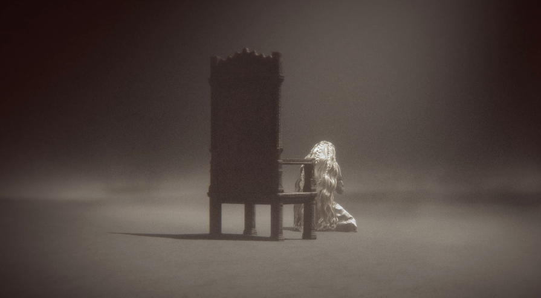

# メタデータ
- title=ELDEN RING BLOG 10: DLCをクリアしました！
- description=フロムソフトウェアのELDEN RINGを今更ながら初見プレイして記録を残そうと思います。ずっと放置していたDLCの最後のボスを倒しました。
- date=2026年1月10日（土）
- update=2026年1月10日（土）
- math=false
- tag=elden-ring

## はじめに

### 概要

2022年2月25日に発売されたフロムソフトウェアの『ELDEN RING』（以下、エルデンリング）を今更ながら初見でプレイしています。
今回でようやくDLCのラスボス、ラダーンとミケラを倒せました。
これでひとまずエルデンリングのブログも最終回です。

ELDEN RING

### 公式サイト

下記が今作の公式サイトのリンクです。

https://www.eldenring.jp/index.html

ELDEN RINGの公式サイト

### 前回の記事

2025年9月28日の日記です。

https://yusukekato.jp/html/2025/0928.html

ELDEN RING BLOG 9: DLCに挑戦した

### 注意事項

まだELDEN RINGをプレイしていない方は、ネタバレになってしまうのでご注意ください。

## 本日の冒険の記録

### ラダーンとミケラ

一年ぶりくらいにラダーンとミケラに再開しました。

ラダーンとミケラ

### 約束の王ラダーンを倒した

ようやくラダーンとミケラを倒しました。
本当はずっと愛用していた巨人砕きで倒したかったのですが、
そのままずっと倒せず放置してしまっていたので、
今回は攻略サイトを見て血の蟻棘のレイピアと指紋石の盾で倒しました。

下記の攻略サイトを参考にさせていただきました。

https://gamewith.jp/eldenring/454066

GameWith - 【エルデンリング】約束の王ラダーンの攻略とNPC召喚方法｜ラスボス【DLC】

出血や腐敗ダメージを狙っていくとよいとのことでしたが、
単純に盾構えながらチクチク攻撃できるので、
ラダーンの攻撃を避ける必要もなくあっさり倒せました。
ちなみに私は180レベルまで上げていて、
筋力と技量を50～60まで上げられて（レラナのところでステータスを振り直しました）、
ダメージの通りがかなりよかったです。

ラダーン倒した

ダークソウルの頃から筋力上げてデカい武器で戦ってきましたが、
もっといろいろな戦い方で遊んでも楽しそうだなと思ってきています。

### ミケラの回想

ラダーンを倒した後、光に触れるとミケラの回想が見れました。
ミケラはラダーンこそが王だと信じていたという感じですよね。
久しぶり過ぎてストーリーがあまり記憶にないですが、
ミケラとラダーン、あとはマレニアは複雑な関係そうです。

ミケラの回想1

ミケラは男性だと思っていましたが、見た目はかなり女性です。
そもそも神的な存在なので性別は関係ないのかもしれません。
マリカとラダゴンも見た目は女性と男性になっていたのでそうなのだと思います。

ミケラの回想2

### 最後の写真

ということで本編とDLCをクリアした姿です。
ラダーンの防具がお気に入りです。

クリア

## おわりに

エルデンリングのDLCのラスボス、約束の王ラダーンを倒しました。
このブログもこれで最終回になるかと思います。
エルデンリングはフィールドを探索するのも楽しいし、
ボスも多種多様で倒しがいがあるし、
武器や装備アイテム、魔術、祈祷などやれることもたくさんあるしで、
文句なしに最高の作品だと思います。

ダークソウルやブラッドボーンなどと比較しても体感でボリュームが3～5倍くらいあってやり込もうと思ったらいくら時間があっても足りなさそうです。
私は結構サクサクプレイを目指していました。
それでも100時間以上かかっています。
ゲームの完成度が高すぎて怖いくらいです。
皆さまももしまだプレイしていなかったらぜひ遊んでみてください。
アクション系が苦手でなければ本当におすすめのゲームです。

それでは、また。