# メタデータ
- title=【VRChat】UnityとBlenderでアバターのパーツを作る
- description=UnityとBlenderを使ってVRChat用アバターの手を自作してみようと思います。
- date=2026年1月11日（日）
- update=2026年1月11日（日）
- math=false
- tag=vrchat

## はじめに

今回はVRChatのアバターの手を既存モデルをベースに自作してみようと思います。
使用ソフトはもちろんBlenderです。
モデリングは、Blenderをほんの少し触ったことがあるのと、
あとはCADソフトを少し触ったことがあるくらいの初心者です。

分からないことがたくさんあるのでインターネットで調べたりGeminiに聞いたりしながら作業を進めました。
結果としてひとまずVRChat上で動く状態までできました。
この記事では作成手順を記録していきます。

GIF画像↓

手の動作確認

YouTube↓

https://www.youtube.com/embed/qytL96ad69w

## 開発環境

開発環境は下記の通りです。

バージョンが異なると同じように動かない場合があります。

- Windows 11
- Blender 5.0
- Unity 2022.3.22f1
- VRChat SDK 3.10.1

## 使用アバター

アバターはニコニコのアリシア・ソリッドの3Dモデルを使用しています。

https://3d.nicovideo.jp/alicia/

アリシア・ソリッド公式サイト

VRChatで使用する方法は下記の記事にまとめています。

https://yusukekato.jp/html/2025/0927.html

公開されているVRMモデルをVRChatで動かす

## Blenderをインストール

オープンソースの3DモデリングソフトであるBlenderをインストールします。

https://www.blender.org/download/

Blenderの公式サイト

## Blenderにアバターのモデルデータをインポート

追記：最初はFBX形式のモデルをインポートしましたが、ボーン（アーマチュア）が正しく読み込めなかったので、VRM形式のモデルをインポートしました。
VRM形式のモデルは後述するアドオンを入れることでインポートできます。

アリシア・ソリッドの3DモデルはFBX形式（本当はVRM形式）のファイルで取得できたので、
Blenderを開いてからファイル > インポート > FBXを選択して読み込みます。

インポート

インポートに成功するとBlender画面上にアバターのモデルが表示されます。

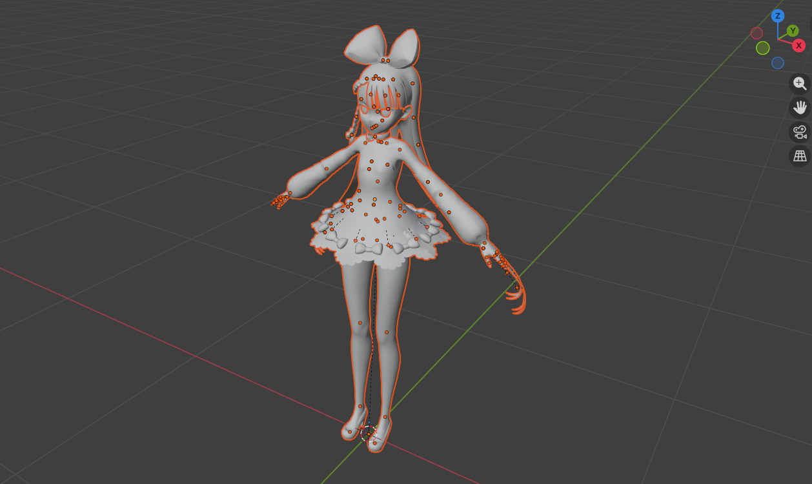

モデルをインポート

## 手のパーツだけモデルから切り分ける

アリシア・ソリッドの3Dモデルは身体全体が一つのオブジェクトになっているので、自作する手の部分だけ切り分けます。

まず体の部分をクリックして選択してTABキーを押して編集モードに切り替えます。
すると下記の画像のようにメッシュ（三角形の網目）が確認できます。

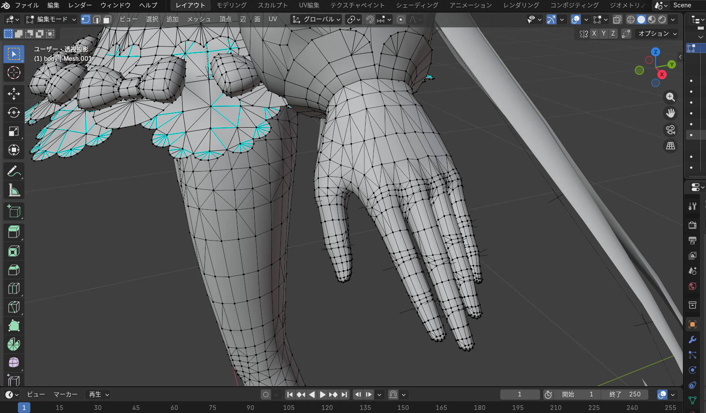

メッシュ

次に手のメッシュの頂点をどれか一つクリックして選択してからLキーを押すと手の部分全体を選択できます。
オブジェクトとしては身体全体がひとまとまりになっていますが、
メッシュとしては各パーツでちゃんと分かれているようです。

手全体を選択

次にPキーを押すと「分離」ウィンドウが表示されるので「選択」をクリックして選択した手のパーツを体全体から分離します。

分離

分離が成功すると画面右上のオブジェクトの一覧に元々あった体全体の「body」から手のパーツが「body.001」という名前で分離していることが確認できます。

分離成功

手のパーツは「body.001」から「hand」に名称変更しておきます。

試しにhandを非表示にすると手のパーツだけ非表示になりました。

手を非表示

## 人差し指を作る：立方体を追加

まずは人差し指を作ってみます。

Shift+Aキーを押して「追加」ウィンドウが表示されたら、
メッシュ > 立方体を選択します。

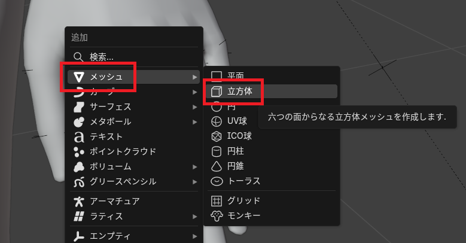

立方体

アバターに対して大きめの立方体が追加されました。

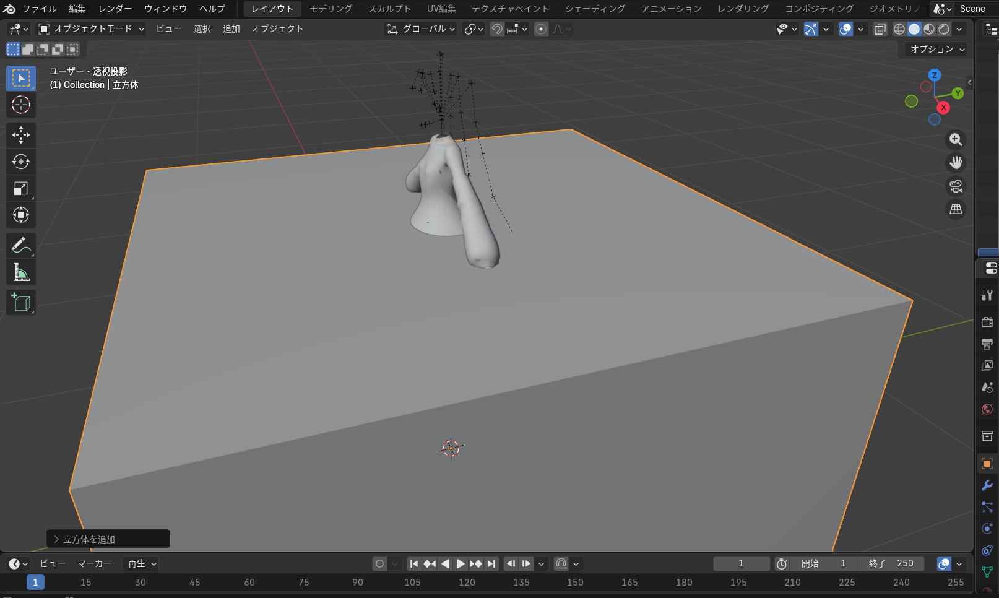

立方体追加

## 人差し指を作る：立方体の大きさ調整

立方体をクリックして選択してからTABキーを押して編集モードに切り替えます。
画面右側の「トランスフォーム」でXYZの値を入力して指の大きさになるように調整します。

スケール調整

## オブジェクトモードと編集モード

ちなみに、オブジェクト自体に変更を加える時は「オブジェクトモード」で作業を行い、オブジェクトのメッシュ（ポリゴン）を編集する時は「編集モード」で作業を行うようです。

立方体の大きさを変更する場合、オブジェクトモードで変更するとオブジェクト全体の倍率を変更することになるようで、実際の大きさを変更するためには編集モードで作業を行うとよいみたいです（まだあまりよくわかっていません）。

## 人差し指を作る：移動と回転

オブジェクトモードに切り替えてから指のオブジェクトの位置と向きを元々の指の位置に合わせます。

オブジェクトをクリックして選択してからGキーを押すと移動、Rキーを押すと回転ができます。
また、Gキーを押してからXキーを押すとX軸方向に限定して移動できます。
同じようにRキーを押してからYキーを押すとY軸まわりに限定して回転できます。

さらに、Gキーを押してからXキーを押すとワールド座標系のX軸方向で移動しますが、もう一度Xキーを押すとオブジェクトのローカル座標系のX軸方向に移動できて便利です（回転も同様）。

移動と回転

## 人差し指を作る：関節

現状はただの直方体なので指を曲げようとすると動きがおかしくなります。
そのため直方体を3つに分割して関節を作ってあげる必要があります。

編集モードで指のオブジェクトを選択してCtrl+Rキーを押します。
するとオブジェクトを分割する黄色の線が表示されます。

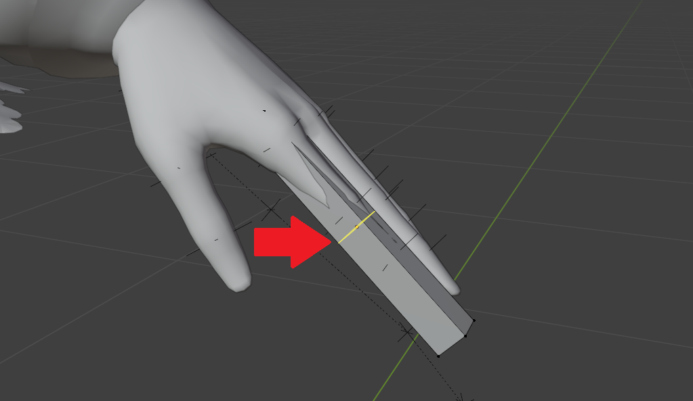

分割線

この状態だとオブジェクトを2つに分割することになるので、
マウスのホイールを上側に回して線を2つに増やします。

分割線2つ

左クリックしてカーソルを動かすと分割線の位置をスライドできます。
だいたいの位置を決めたら右クリックを押して分割します。

編集モードの状態で3キーを押して面選択モードに切り替えて指のオブジェクトをクリックすると、分割できていればそれぞれの面を選択できます。

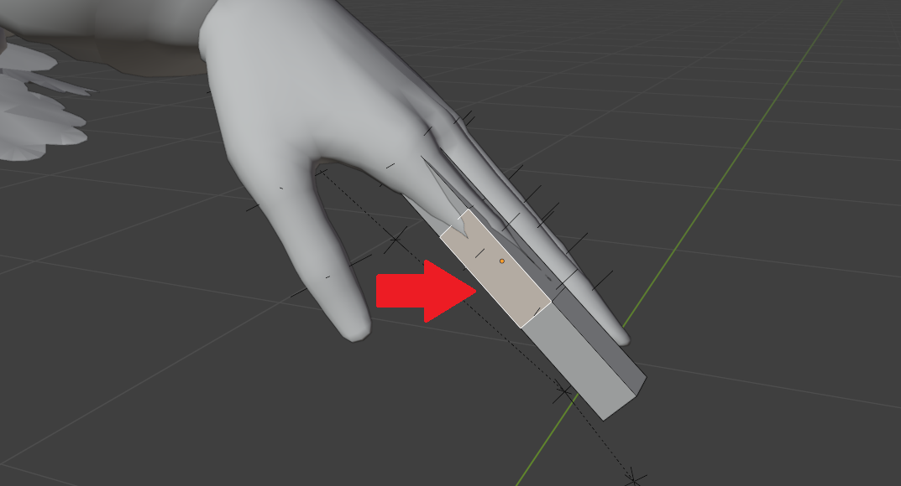

面選択

## 人差し指を作る：関節位置の調整

関節位置がちゃんと決まっていないので調整します。
まず作業がしやすいように画面右上にある二重の四角のボタンを押してオブジェクトを透過させます。

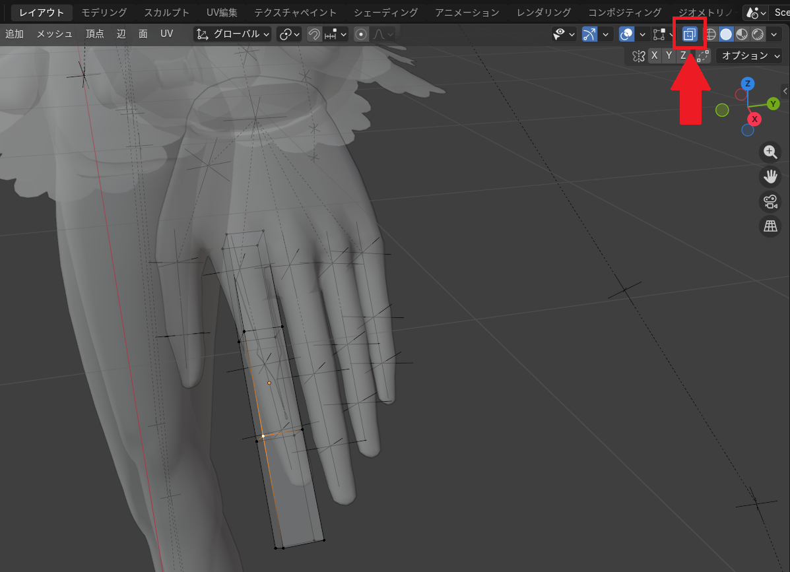

透過

2キーを押して辺選択モードに切り替えて分割線を選択します。
Altを押しながら左クリックで分割線4本を選択できます。

分割線を選択できたらGキーを押して移動させます。
指先方向に限定して動かしたいので指先方向の軸（私の場合はX軸）を確認してから対応したキー（私の場合はXキー）を2回押して分割線を移動させます。

元々あるボーンの関節位置に合わせる必要もあります（私は後の工程で合わせています）。

分割線の移動

以上の手順を二つの関節で行って、関節の位置を調整します。

## 人差し指を作る：太さを変える

根本を太く先端を細くしたいので指オブジェクトの太さを変更してみます。

編集モードで先端の面を選択してからSキーを押すと面の大きさを変更できます。
面を小さくすればそれに合わせて先端側の直方体が細くなります。

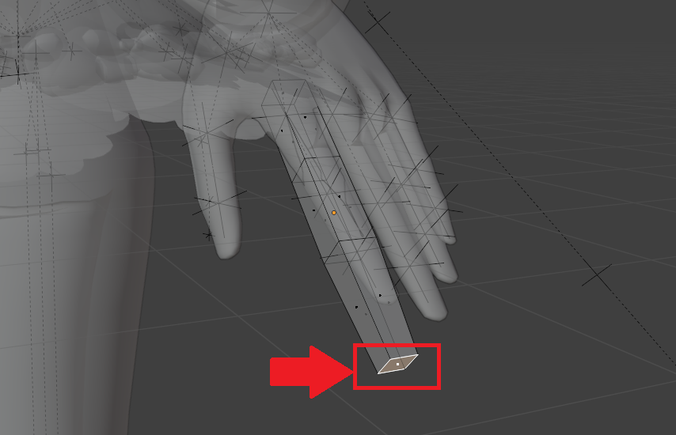

先端を細くする

同じように根本も太くしました。
関節部分もAltを押しながら分割線をクリックしてSキーを押して大きさを変更できます。

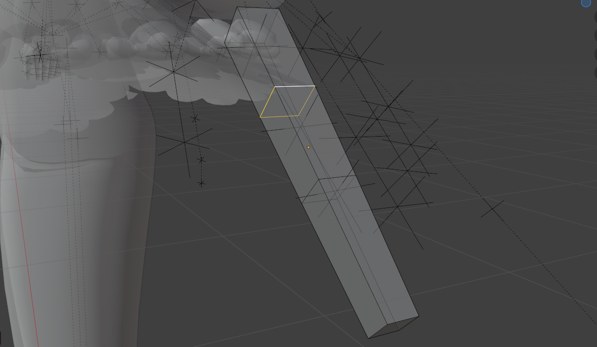

全体の太さを調整

以上で指全体の太さを調整できました。

## 人差し指を作る：関節を補強

現状関節一つに対して分割線が1つだけですが、
これだと指を曲げた時に見た目がおかしくなるようなので、
すでにある分割線の上下にさらに分割線を2つ追加して、
合計で一つの関節に3つの分割線を作ります。
分割線はCtrl+Rで追加して左クリックを押してから移動できます。

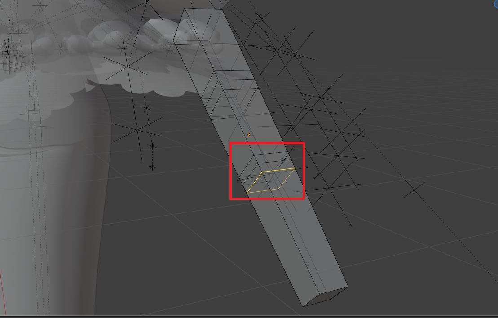

関節を補強

## 人差し指を作る：ボーンに位置と向きと大きさを合わせる

追記：この後でボーンを「黒い線」と記載していますが、この黒い線はただの目印の線っぽいです。
実際のボーンは三角形みたいなの見た目をしています。

下記の画像が実際のボーン↓

実際のボーン

既存のモデルのボーン（黒い線）と指オブジェクトがずれているのでちゃんと合わせます。
合わせる項目は位置と向き、大きさ、そして関節位置です。
これまではだいたいで合わせていたのでここでちゃんと合わせます。

おさらいですが移動はGキー、回転はRキー、大きさ変更はSキーです。
またそれぞれでX,Y,Zキーを押すことで軸を制限できます。

下記の画像がずれている状態です。

ずれている状態

位置と向き、大きさ、関節位置を調整した状態です。

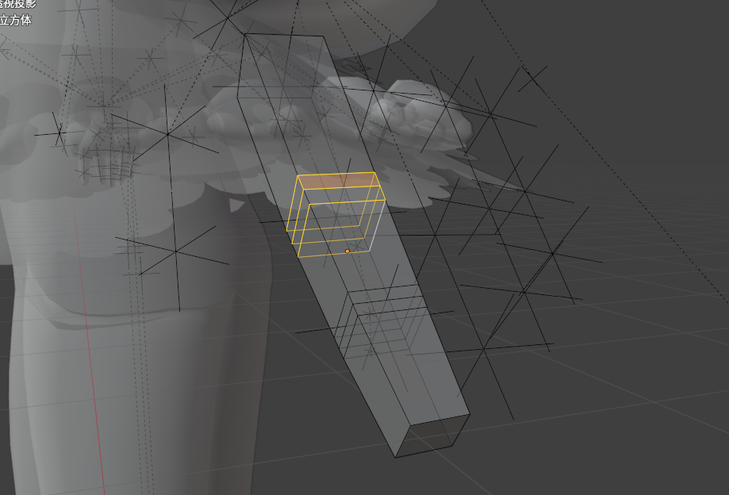

修正した状態

以上で人差し指がだいたい完成です。

## 他の指を作る

人差し指が完成したのでコピーして他の4つの指を作成します。

編集モードで指オブジェクトの頂点や辺を選択してからLキーを押して指全体を選択します。
その後にShift+Dキーを押すことで指オブジェクトを複製します。
マウスカーソルを移動させると複製した指オブジェクトも移動するのでだいだいの位置で左クリックを押して配置します。

その後は人差し指作りと同様に他の指の位置と向き、大きさ、関節の位置を元々のボーンに合わせます。

位置を合わせた

一つ注意点として、指は5本で一つのオブジェクトになり、原点が一つだけ設定されます（だいたい中指あたり）。
そのため、たとえば親指の位置や向きを調整する時、5本の指全体の座標系の軸に従って移動したり回転したりするので調整が難しいです。

一応の解決策として、画面中央上部にある「トランスフォームピボットポイント」を「それぞれの原点」などに設定しておいて、
回転させる場合はRキーを2回押してマウスカーソルに合わせて回転させるとよいです。
位置は頑張って合わせました。

オブジェクトを指ごとに分離すると簡単に位置や向きを合わせられそうですが、
再び一つのオブジェクトに合わせる作業が必要なので一長一短になりそうです。
一般的にどうするのは不明です。

トランスフォームピボットポイント

## 手のひら（手の甲）を作る

指が完成したので手のひら（手の甲）を作成します。

編集モードでShift+Aを押して立方体を追加します。
元々の手を参考に立方体の位置と向き、大きさを調整します。

さらに指の関節を作った時のようにCtrl+Rキーを押して分割線（分割しないです）を追加して、
分割線を基準に手のひら（手の甲）の形を整えます。

手のひら

## 手首を作って関節を追加

手首にも関節があるので追加します。

まず手首側の面を選択してからEキーを押して押し出しを行います。
マウスカーソルを動かすと面の部分が伸びます。

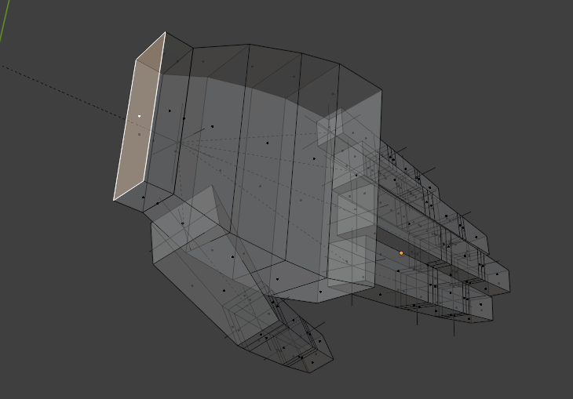

手首

手首のボーンに合わせて関節を追加します。
指と同様に分割線が3つになるように追加します。

関節

## 面取りして角を削る

今回は義手を作ろうと思っていたので無骨な感じでよいですが、
面取り（角を削る）も簡単にやっておこうと思います。

編集モードで辺や面を選択してからCtrl+Bを押すと面取りが行えます。

面取り

## 注意：3Dモデルをインポートし直した

私が読み込んだFBX形式のモデルではボーン（アーマチュア）が正しく読み込めていないようでした（そもそも設定がないのかも？）。

そこでVRM形式の3Dモデルをインポートし直しました。

BlenderでVRM形式のファイルをインポートするためにはアドオンが必要です。
VRM形式のインポート方法は下記の記事を参考にさせていただきました。

https://qiita.com/tsukino_/items/721493dab0ef6e7fba89

Qiita - 【Blender】VRoid Studioで作成した3DモデルをFBX形式に変換する方法

## 自作の手とボーンの位置を合わせる

これまでと同様に手のオブジェクトの位置をボーンに合わせました。
今回はオブジェクトモードで位置合わせを行ったので、
移動完了後に手のオブジェクトを選択してCtrl+Aを押して
「全トランスフォーム」を選択して内部的にも位置を合わせる必要がありました。

位置合わせ

全トランスフォーム

## ボーンと手のオブジェクトを紐づけてウェイトを設定する

この状態ではまだボーンと手のオブジェクトは何も関係していません。
オブジェクトモードで手のオブジェクトを選択してから、
Shiftキーを押しながらボーンを選択して、
Ctrl+Pキーを押してウェイトの設定を行います。

するとペアレント関係を行うウィンドウが出てくるので、
「自動のウェイトで」を選択します。
これで自動的に紐づけが行われます。

設定

確認として、手のオブジェクトを選択してからボーンを選択して、
左上のオブジェクトモードのところをポーズモードに切り替えます。
そして適当なボーンを一つ選択してRキーを押して回転を行うと、
ボーンに合わせて手や指が動きます。

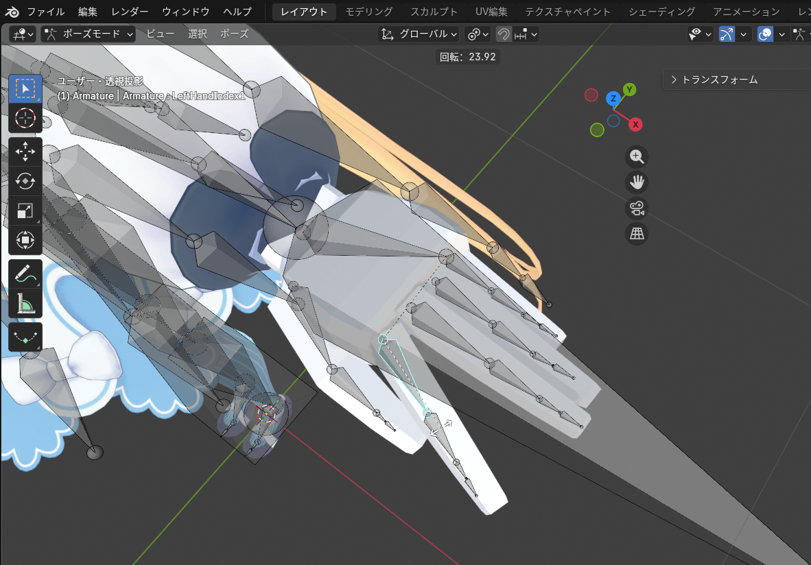

手を動かす

## 補足：動かない頂点があったらボーンのウェイトを調整する

私の場合、なぜか自動でウェイトを設定しても頂点が一つだけ動きませんでした。
これはウェイトを手動で調整して解決しました。

手順としては、手のオブジェクトを選択して編集モードへ切り替えます。
動かない頂点を選択して頂点ウェイトを確認します。
この頂点ウェイトはコピーができるので、
動かない頂点を選択してから隣の動く頂点をCtrlを押しながら複数選択して、
コピーボタンを押して動く頂点のウェイトを動かない頂点へコピーしました。

私の場合はこれで解決しました。

ウェイト設定

## 金属感のあるマテリアルを設定

今回は義手を作っているので（形状は全然義手っぽくないですが）、
金属感ある表面にしたいと思います。

オブジェクトモードで手のオブジェクトを選択して画面右下のマテリアル設定を開きます。
そこで新規でマテリアルを作成して、
色は黒っぽい色、メタリックの値を1.0、荒さを0.3程度にしました。

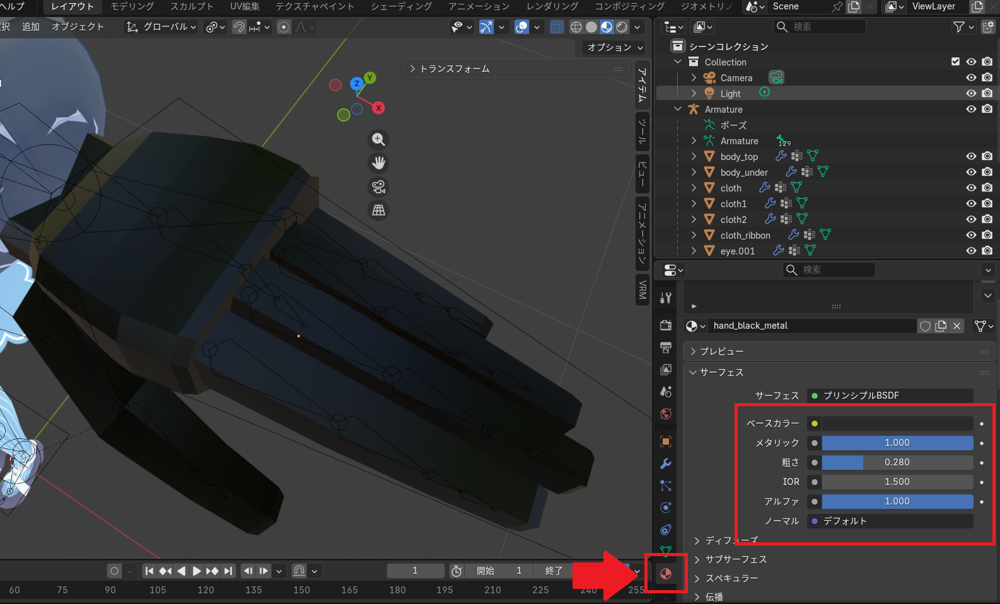

マテリアル

## VRM形式でエクスポート

私はVRMのアドオンを入れたのでVRM形式でモデルを出力します。
Unityが対応している形式なら何でも大丈夫だと思います（おそらく）。

エクスポート

## Unityでインポート

先ほどエクスポートしたVRM形式のモデルをインポートします。

VRM形式のモデルのインポート方法は下記の記事にまとめています。

https://yusukekato.jp/html/2025/0927.html

公開されているVRMモデルをVRChatで動かす

インポート

## マテリアルにlilToonを設定

マテリアルにVRChatのアバターでよく使われているlilToonのシェーダーを設定します。

lilToonはlilLabさんのBoothからダウンロードできます（ありがたいです）。

https://booth.pm/ja/items/3087170?srsltid=AfmBOoo9VY2S1kp-smTI1cqN0lSlui9WtpNAVaUrZCiX-S2pcdYZCJ6v

【無料】lilToon

プリセットに金属用があったのでそれを選択して色だけ黒っぽい色に変更しました。

メタル

## VRChatへアップロード

最後にアバターをVRChatへアップロードして動作確認します。

無事に自作した手がVRChatで動くことを確認できました。

GIF画像↓

手の動作確認

YouTube↓

https://www.youtube.com/embed/qytL96ad69w

## おわりに

今回はVRChatのアバターの手を自作してみました。
Blenderはほんの少し触ったことがあるくらいで、
アバターのパーツの3Dモデリングは初めてでしたが、
ひとまず動いてよかったです。
少しずつ慣れていっていずれちゃんとしたアバターが作れるくらいになったら嬉しいです。
それでは、また。